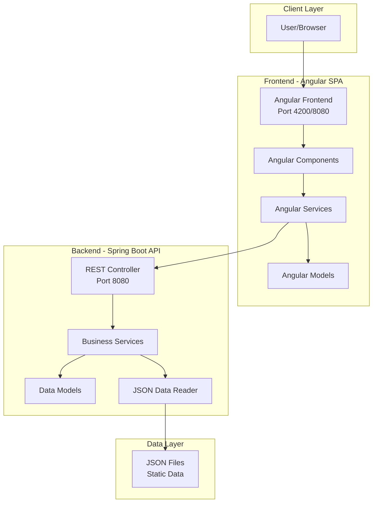
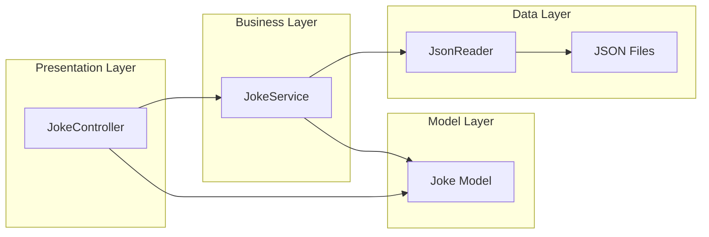
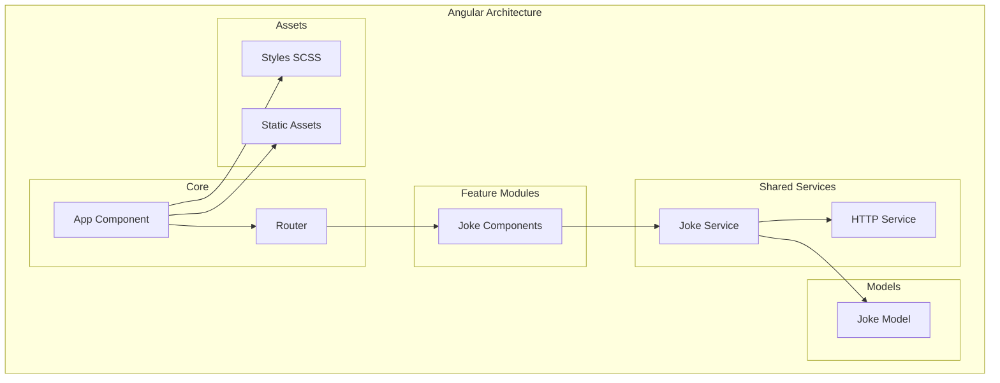
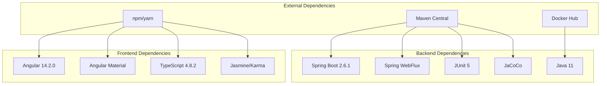
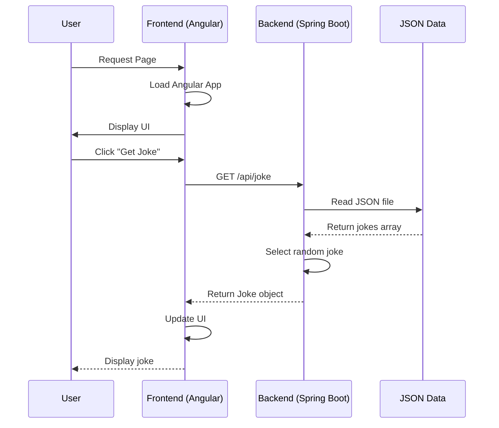
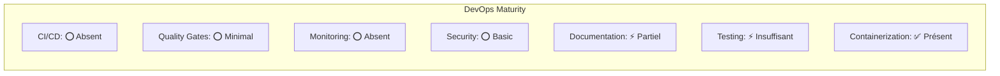
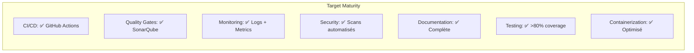

# Analyse Complète du Projet BobApp

## Vue d'ensemble

**BobApp** est une application web composée d'un backend Java/Spring Boot et d'un frontend Angular, conçue pour fournir des blagues via une API REST.

### Composition technique
- **Backend** : Spring Boot 2.6.1 + Java 11 + WebFlux (réactif)
- **Frontend** : Angular 14.2.0 + TypeScript 4.8.2 + Angular Material
- **Architecture** : REST API + SPA (Single Page Application)
- **Conteneurisation** : Docker avec multi-stage build

## Architecture globale du système

## Structure détaillée des modules

### Backend - Architecture hexagonale

### Frontend - Architecture Angular

## Analyse de la qualité du code

### Points forts actuels

#### Backend ✅
- **Architecture Spring Boot** bien structurée (Controller/Service/Model)
- **Programmation réactive** avec WebFlux
- **Séparation des responsabilités** respectée
- **JaCoCo configuré** pour la couverture de code
- **Dockerisation** fonctionnelle

#### Frontend ✅
- **Architecture Angular moderne** avec TypeScript strict
- **Séparation des couches** (composants/services/modèles)
- **Tests unitaires** présents (Jasmine/Karma)
- **Configuration de coverage** active
- **Build multi-stage** optimisé

### Axes d'amélioration identifiés

#### Backend ⚠️
- **Tests insuffisants** (seulement test de contexte)
- **Configuration Spring** minimale
- **Gestion des erreurs** basique
- **Logging** non configuré
- **Profils d'environnement** absents

#### Frontend ⚠️
- **Outils de linting moderne** manquants (Biome)
- **Scripts CI/CD** incomplets
- **Configuration SonarQube** absente
- **Tests end-to-end** manquants

## Matrice de dépendances

## Flux de données applicatif

## Évaluation de la maturité DevOps

### État actuel

### Objectifs cibles

## Roadmap d'amélioration

### Phase 1 - Qualité du code (Sprint 1-2)
1. **Backend** : Ajout tests unitaires et d'intégration
2. **Frontend** : Configuration Biome + tests complémentaires
3. **Configuration** : Profils Spring + environnements Angular

### Phase 2 - CI/CD (Sprint 3-4)
1. **GitHub Actions** : Pipelines automatisés
2. **SonarQube** : Analyse statique et quality gates
3. **Docker** : Optimisation et sécurisation

### Phase 3 - Monitoring & Performance (Sprint 5-6)
1. **Logs structurés** : Logback + ELK Stack
2. **Métriques** : Actuator + Prometheus
3. **Performance** : Tests de charge et optimisations

## Recommandations techniques prioritaires

### Immédiat (Sprint actuel)
- ✅ Compléter la couverture de tests (objectif 80%)
- ✅ Configurer Biome pour le frontend
- ✅ Ajouter profils Spring Boot

### Court terme (1-2 sprints)
- 🔄 Implémenter pipeline GitHub Actions
- 🔄 Intégrer SonarQube avec quality gates
- 🔄 Optimiser configurations Docker

### Moyen terme (3-4 sprints)
- 📋 Ajouter monitoring et observabilité
- 📋 Sécuriser l'application (HTTPS, headers sécurisés)
- 📋 Implémenter tests end-to-end

---

*Document généré dans le cadre de l'analyse technique du projet BobApp*
*Méthode TDD appliquée - Tests en parallèle du développement* 