# Workflow CI/CD - BobApp

## Vue d'ensemble du processus DevOps

Ce document détaille la stratégie CI/CD mise en place pour le projet BobApp, utilisant GitHub Actions comme orchestrateur principal et SonarQube pour l'analyse de qualité.

### Objectifs du workflow
- **Intégration continue** : Tests automatisés à chaque commit
- **Déploiement continu** : Livraison automatisée selon les environnements
- **Quality Gates** : Contrôles qualité obligatoires
- **Feedback rapide** : Retours développeurs en moins de 10 minutes

## Architecture du pipeline CI/CD

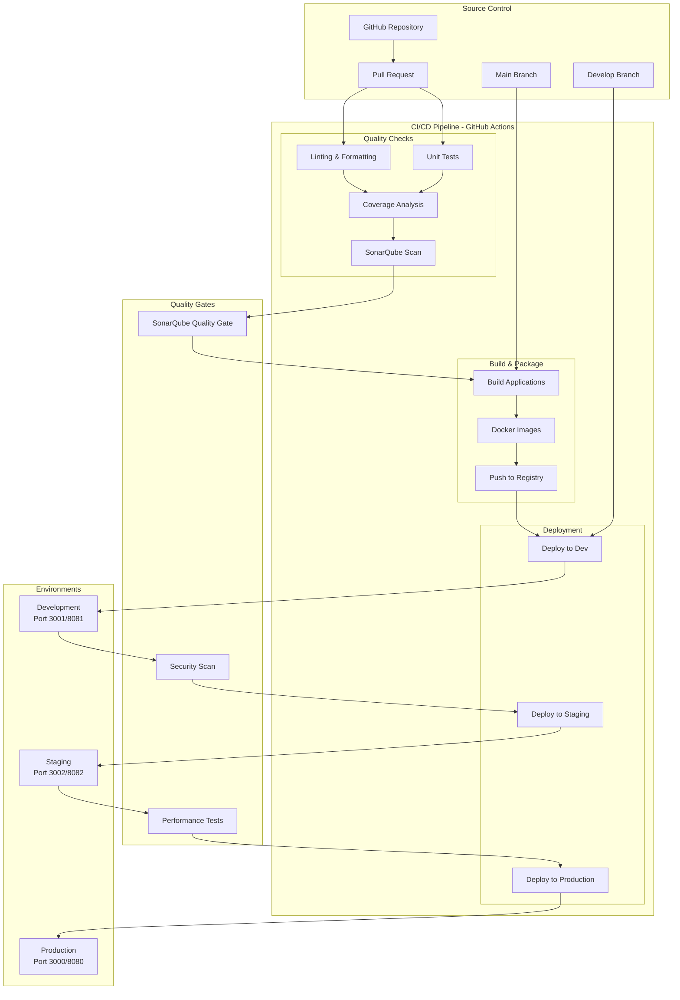

## Stratégie de branchement - GitFlow adapté


## Workflow détaillé par trigger

### 1. Pull Request Workflow

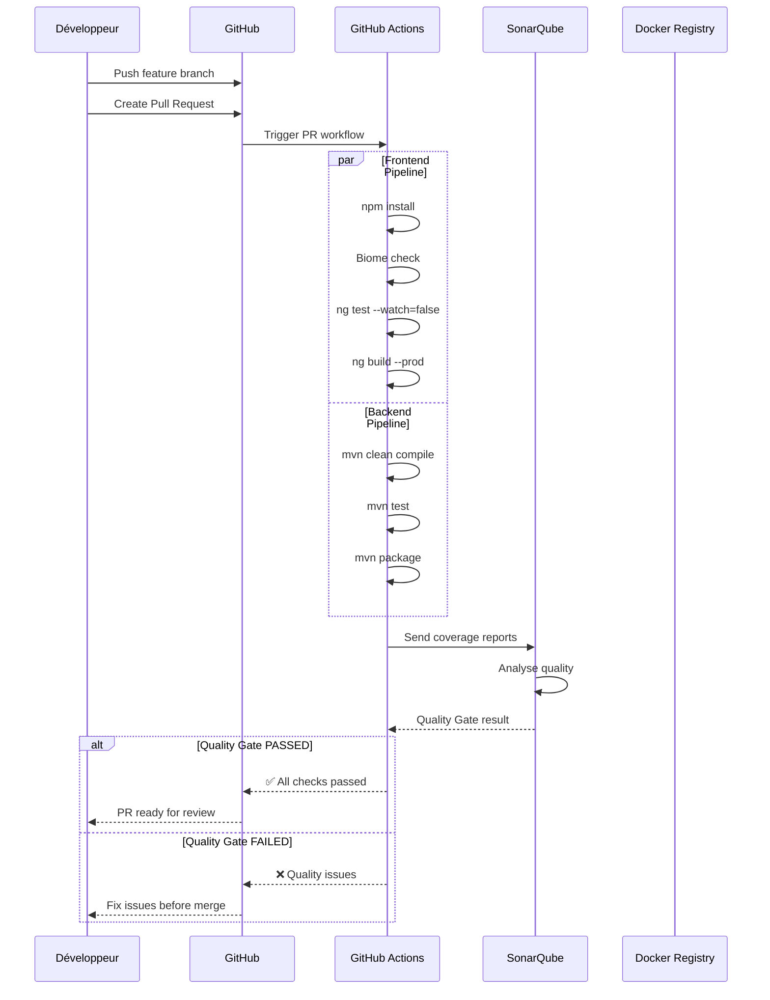

### 2. Main Branch Deployment

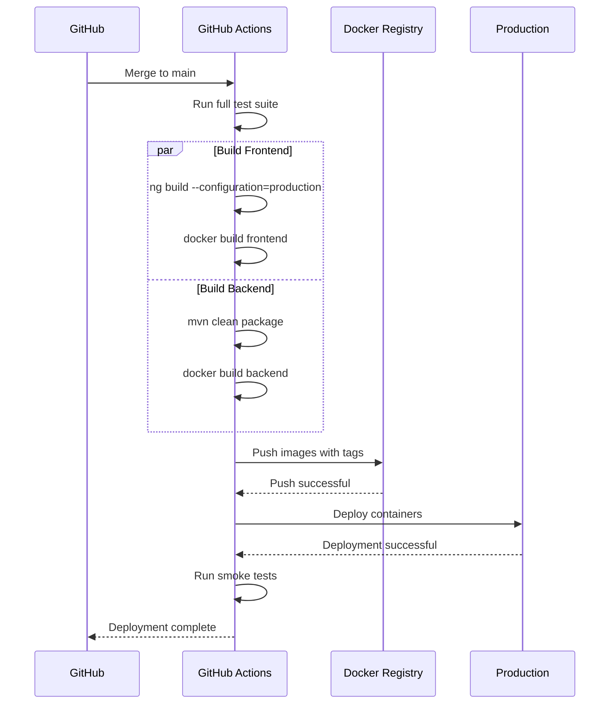

## Configuration des environnements

### Variables d'environnement par stage

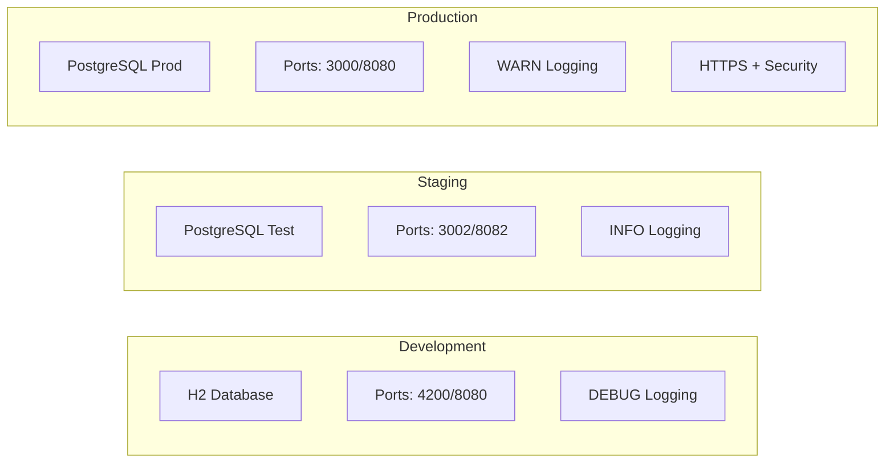

## GitHub Actions - Structure des workflows

### Structure des fichiers

```
.github/
├── workflows/
│   ├── frontend-ci.yml          # CI Frontend (PR + merge)
│   ├── backend-ci.yml           # CI Backend (PR + merge)
│   ├── deploy-staging.yml       # Déploiement staging
│   ├── deploy-production.yml    # Déploiement production
│   └── security-scan.yml        # Scans sécurité hebdomadaires
├── dependabot.yml              # Updates automatiques dépendances
└── CODEOWNERS                  # Code review obligatoire
```

### Workflow Frontend CI

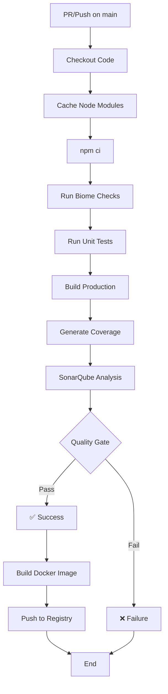

### Workflow Backend CI

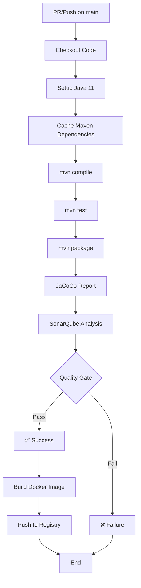

## Quality Gates et métriques

### Critères SonarQube

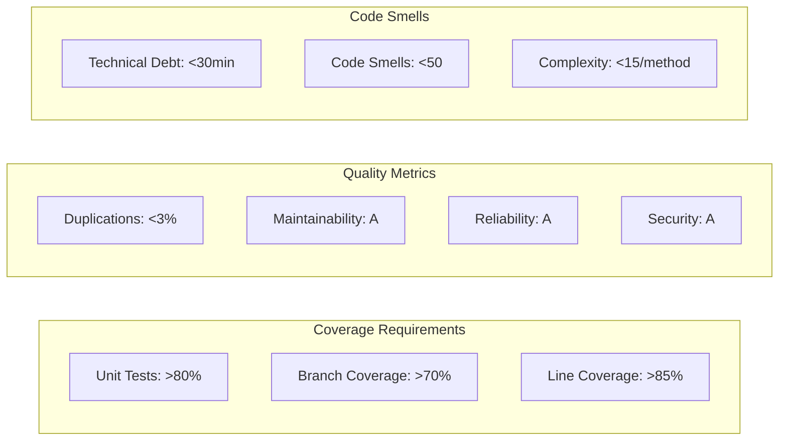

### Workflow de validation qualité

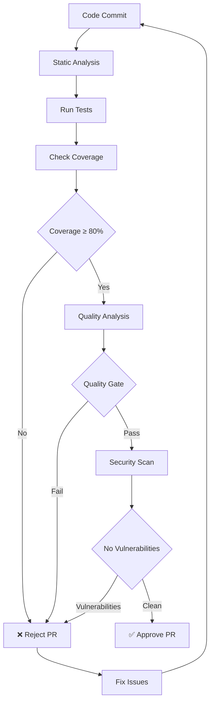

## Déploiement et rollback

### Stratégie de déploiement Blue/Green

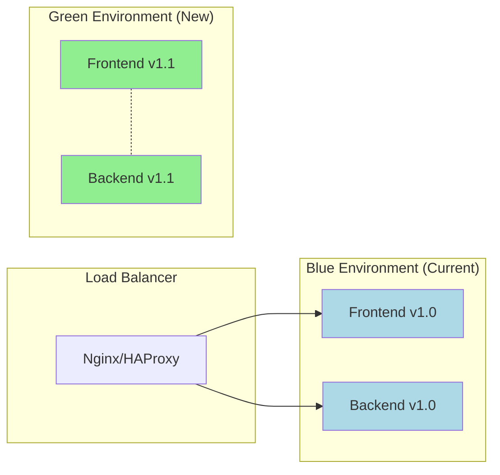

### Processus de rollback automatique

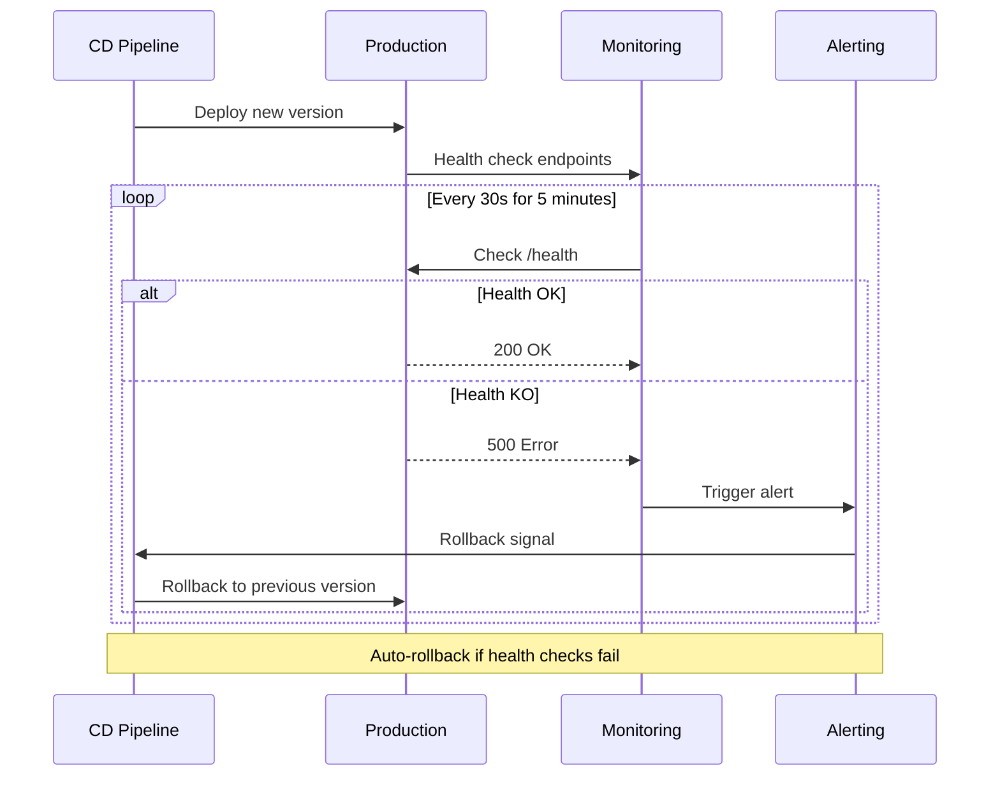

## Monitoring et observabilité

### Métriques surveillées

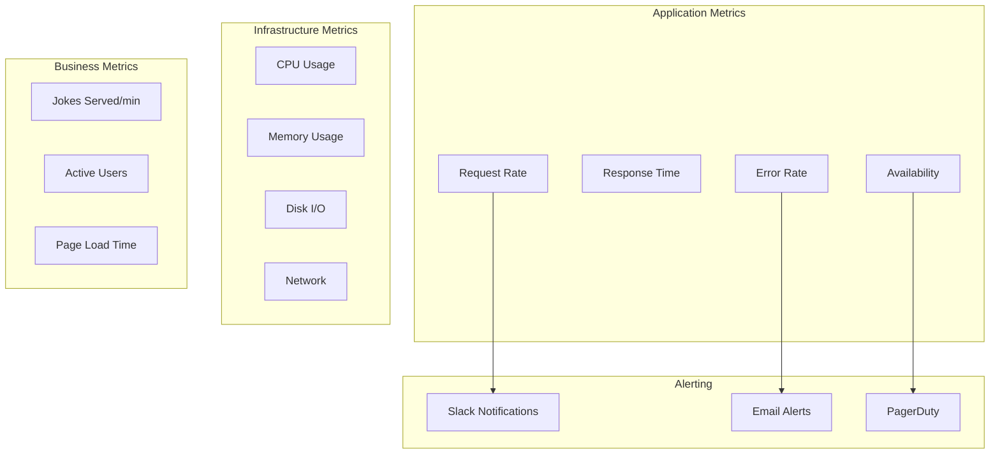

## Sécurité dans le pipeline

### Scans de sécurité intégrés

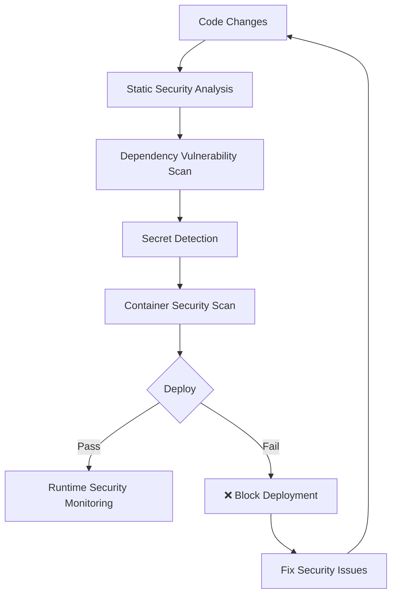

---

*Workflow CI/CD établi selon les meilleures pratiques DevOps*
*Méthode TDD : Tests automatisés à chaque étape du pipeline* 